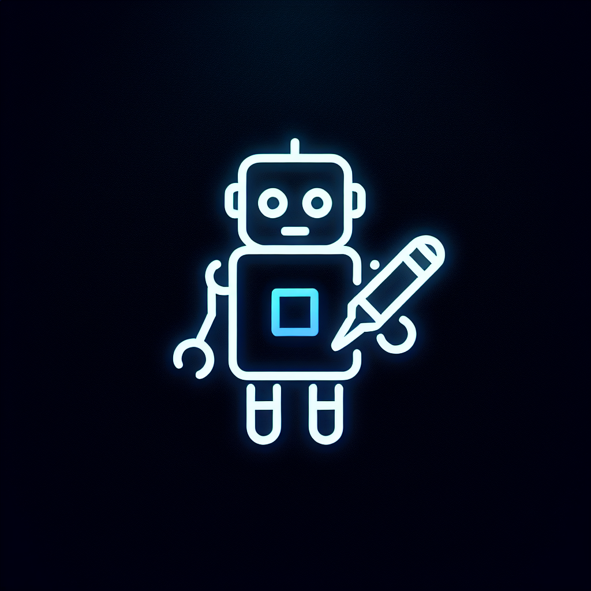

#  Ccoin Discord Bot 

<div align="center">
  
  <h1>🎮 Ccoin Discord Bot 🎮</h1>
  <p>🚀 <b>ربات پیشرفته گیمینگ دیسکورد با هوش مصنوعی، سیستم اقتصادی و بازی‌های گروهی جذاب</b> 🚀</p>
  
  
  
  
  
</div>

##  معرفی | Introduction

Ccoin یک ربات فوق‌العاده پیشرفته برای دیسکورد است که با ترکیب فناوری هوش مصنوعی CCOIN AI (براساس Gemini)، سیستم اقتصادی تعاملی و بازی‌های گروهی هیجان‌انگیز، تجربه‌ی بی‌نظیری را برای کاربران سرورهای دیسکورد ایجاد می‌کند! 🎯

با قابلیت‌های متنوع از جمله کیف پول دیجیتال، بازی‌های جذاب مانند گرگینه و مافیا، دستیار هوش مصنوعی و سیستم نکات هوشمند، Ccoin یک همراه ایده‌آل برای سرورهای دیسکورد فارسی و انگلیسی است. 🌐

##  ویژگی‌های اصلی | Core Features

###  هوش مصنوعی قدرتمند
- 🤖 **CCOIN AI**: دستیار هوشمند با قابلیت پاسخگویی به پرسش‌ها و ایجاد محتوای خلاقانه
- 💬 **چت هوشمند**: امکان گفتگو با هوش مصنوعی از طریق دستور `/askai`
- 💡 **سیستم نکات هوشمند**: ارسال نکات جالب و کاربردی بصورت دوره‌ای در کانال‌های تعیین شده

###  اقتصاد پیشرفته
- 👛 **کیف پول دیجیتال**: مدیریت سکه‌های مجازی برای هر کاربر
- 💸 **انتقال سکه**: امکان ارسال سکه به دوستان و دیگر اعضای سرور
- 🏪 **فروشگاه**: خرید آیتم‌های متنوع و ویژه با سکه‌های جمع‌آوری شده
- 🎁 **جوایز روزانه**: دریافت سکه‌های رایگان با حضور روزانه در سرور

###  بازی‌های گروهی هیجان‌انگیز
- 🐺 **گرگینه**: بازی استراتژیک گروهی با نقش‌های مختلف و گیم‌پلی جذاب
- 🕵️ **مافیا**: بازی نقش‌آفرینی کلاسیک با مکانیک‌های مدرن
- 🎯 **مینی‌گیم‌ها**: شامل بازی‌هایی مانند دوئل، شرط‌بندی و دیگر سرگرمی‌های جذاب
- 🎮 **جلسات بازی**: مدیریت آسان جلسات بازی با رابط کاربری زیبا و کاربرپسند

###  مدیریت اجتماعی
- 👨‍👩‍👧‍👦 **سیستم کلن**: ایجاد و مدیریت گروه‌های دوستی با امکانات ویژه
- 👫 **دوستی**: سیستم مدیریت دوستان و پروفایل کاربری
- 🛡️ **محافظت**: امکان بلاک کردن کاربران مزاحم
- 📢 **اعلان‌ها**: سیستم اطلاع‌رسانی برای رویدادهای مهم

##  تکنولوژی‌ها | Tech Stack

-  **TypeScript**: برنامه‌نویسی قدرتمند و تایپ-سیف
-  **Node.js**: پلتفرم اجرایی برای برنامه‌نویسی سمت سرور
-  **Discord.js**: کتابخانه رسمی برای توسعه ربات‌های دیسکورد
-  **MongoDB**: دیتابیس NoSQL برای ذخیره‌سازی اطلاعات
-  **Gemini API**: فناوری هوش مصنوعی پیشرفته گوگل (بازنامگذاری شده به CCOIN AI)
-  **پشتیبانی چندزبانه**: پشتیبانی کامل از زبان‌های فارسی و انگلیسی

##  ساختار پروژه | Project Structure

```
.
├── server/                 # سرور اصلی و منطق برنامه
│   ├── discord/            # کامپوننت‌های مرتبط با Discord
│   │   ├── commands/       # دستورات اسلش (/)
│   │   ├── components/     # کامپوننت‌های تعاملی (منوها، دکمه‌ها و غیره)
│   │   ├── handlers/       # پردازشگرهای رویدادها
│   │   ├── services/       # سرویس‌های مختلف (هوش مصنوعی، اقتصاد و غیره)
│   │   └── utils/          # توابع کمکی
│   └── index.ts            # نقطه ورود اصلی برنامه
├── client/                 # رابط کاربری وب (در صورت وجود)
├── shared/                 # کدهای مشترک بین سرور و کلاینت
├── tests/                  # تست‌های برنامه
│   ├── ai-services/        # تست‌های سرویس‌های هوش مصنوعی
│   ├── economy/            # تست‌های سیستم اقتصادی
│   ├── verification/       # اسکریپت‌های تأیید عملکردها
│   └── README.md           # توضیحات مربوط به ساختار تست‌ها
├── admin-panel/            # پنل مدیریت (در دست توسعه)
└── docs/                   # مستندات پروژه
```

##  راه‌اندازی | Setup

###  پیش‌نیازها | Prerequisites

-  **Node.js** (نسخه ۱۶ یا بالاتر)
-  **MongoDB**
-  **توکن بات دیسکورد**
-  **کلید API برای سرویس Gemini**

###  نصب و راه‌اندازی | Installation

1. ریپوزیتوری را کلون کنید:
   ```bash
   git clone https://github.com/yourusername/ccoin-bot.git
   cd ccoin-bot
   ```

2. وابستگی‌ها را نصب کنید:
   ```bash
   npm install
   ```

3. فایل `.env` را با اطلاعات مورد نیاز ایجاد کنید:
   ```
   DISCORD_TOKEN=your_discord_token
   MONGODB_URI=your_mongodb_uri
   GOOGLE_AI_API_KEY=your_gemini_api_key
   ```

4. ربات را اجرا کنید:
   ```bash
   npm run dev
   ```

##  قابلیت‌های هوش مصنوعی | AI Features

###  دستیار هوشمند CCOIN AI

با استفاده از دستور `/askai` می‌توانید سوالات خود را از هوش مصنوعی پیشرفته CCOIN AI بپرسید. این دستیار با لحنی دوستانه و جذاب پاسخ‌هایی هوشمند و کاربردی به شما ارائه می‌دهد. 🎯

```
/askai بهترین روش برای یادگیری برنامه‌نویسی چیست؟
```

###  سیستم نکات هوشمند

سیستم نکات هوشمند CCOIN AI به صورت دوره‌ای در کانال‌های تعیین شده، نکات جالب و کاربردی ارسال می‌کند. این نکات با آیکون‌های جذاب و رنگ‌های متفاوت نمایش داده می‌شوند:

- 🧠 **نکات هوشمند CCOIN AI**: نکات تولید شده توسط هوش مصنوعی (با رنگ بنفش #8A2BE2)
- 💡 **نکات روز**: نکات از پیش تعیین شده (با رنگ آبی #0099ff)

###  تنظیمات هوش مصنوعی

ادمین‌ها می‌توانند رفتار و تنظیمات هوش مصنوعی را با استفاده از دستورات مدیریتی مدیریت کنند:

- تنظیم کانال‌های ارسال نکات هوشمند
- تغییر فرکانس ارسال نکات
- مدیریت دسترسی کاربران به قابلیت‌های هوش مصنوعی

##  سیستم اقتصادی | Economy System

###  کیف پول دیجیتال

هر کاربر دارای یک کیف پول با سکه‌های مجازی Ccoin است. موجودی سکه‌های خود را می‌توانید در منوی اقتصادی مشاهده کنید.

###  روش‌های کسب درآمد

- **حضور روزانه**: دریافت سکه‌های رایگان با ورود روزانه به سرور
- **بازی‌ها**: کسب سکه از طریق برنده شدن در بازی‌های مختلف
- **فعالیت‌ها**: پاداش برای مشارکت در فعالیت‌های سرور
- **مأموریت‌ها**: تکمیل مأموریت‌های اختصاصی برای دریافت پاداش

###  فروشگاه آیتم‌ها

می‌توانید با سکه‌های جمع‌آوری شده خود آیتم‌های متنوعی خریداری کنید:
- آیتم‌های تزئینی
- قابلیت‌های ویژه
- آیتم‌های مصرفی
- و بسیاری موارد دیگر...

###  انتقال سکه

با استفاده از منوی اقتصادی می‌توانید سکه‌های خود را به دوستان یا سایر اعضای سرور انتقال دهید:

```
/transfer @username 100
```

##  بازی‌های گروهی | Group Games

###  گرگینه (Werewolf)

بازی نقش‌آفرینی گروهی با نقش‌های متنوع:
- 🐺 **گرگینه‌ها**: در شب به روستاییان حمله می‌کنند
- 👁️ **پیشگو**: می‌تواند هویت یک بازیکن را در هر شب ببیند
- 👨‍⚕️ **دکتر**: می‌تواند یک نفر را هر شب محافظت کند
- 🎯 **تیرانداز**: می‌تواند یک بار در بازی به یک نفر شلیک کند
- و نقش‌های دیگر...

###  مافیا (Mafia)

بازی کلاسیک مافیا با مکانیک‌های مدرن:
- 🕵️ **مافیا**: در شب به شهروندان حمله می‌کنند
- 👮 **پلیس**: می‌تواند هویت یک بازیکن را در هر شب بررسی کند
- 👨‍⚕️ **دکتر**: می‌تواند یک نفر را در هر شب نجات دهد
- و نقش‌های دیگر...

###  مینی‌گیم‌ها

- **دوئل**: رقابت مستقیم بین دو بازیکن
- **قمار**: شرط‌بندی با سکه‌های مجازی
- **حدس کلمه**: حدس زدن کلمه پنهان
- و بازی‌های دیگر...

##  سیستم بازخورد | Feedback System

 **فرم بازخورد**

کاربران می‌توانند از طریق دکمه بازخورد در منوی راهنما، نظرات و پیشنهادات خود را ارسال کنند. این بازخوردها به کانالی که توسط ادمین‌ها تعیین شده است، ارسال می‌شود.

 **تنظیم کانال بازخورد**

ادمین‌ها می‌توانند با استفاده از دستور زیر، کانال دریافت بازخوردها را تنظیم کنند:

```
/setfeedbackchannel #channel
```

##  توسعه‌دهندگان | Developers

<div align="center">
  <p>🚀 توسعه‌داده شده با ❤️ توسط تیم Ccoin 🚀</p>
  
  <a href="https://github.com/amir17x/ccoin-bot">
    
  </a>
  <a href="https://discord.gg/ccoin-bot">
    
  </a>
</div>

##  مجوز | License

این پروژه تحت مجوز [MIT](LICENSE) منتشر شده است.

---

<div align="center">
   برای اطلاعات بیشتر و راهنمای کامل، به <a href="docs/">مستندات</a> مراجعه کنید.
  
  <p>🌟 به Ccoin ستاره بدهید و از آن در سرور دیسکورد خود لذت ببرید! 🌟</p>
</div>